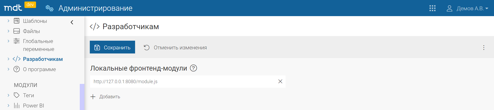

Директория `ui` включает в себя `ui` слой модуля.

## Разработка `ui` слоя

**Подготовка `ui` слоя к разработке**

Для разработки `ui` слоя необходимо в директории с `ui` слоем, выполнить команду:

```yaml
npm install
```

Все зависимости из файла `package.json` загрузятся в проект.

**Что нужно знать для разработки `ui` слоя?**

-   `ui` слой пишется на языке `TypeScript`
-   Взаимодействие с `MDT` происходит через библиотеку `mdt-client`. При разработке вы можете импортировать из нее желаемый сервис или функциональность. Например:

```ts
import { FormService } from "mdt-client";
```

-   Для инициализации модуля вызовите функцию `registerModule`, передав в нее собственную `callback` функцию регистрации модуля.

## Локальное развертывание `ui`

При разработке UI-модулей можно отслеживать изменения локально. Они будут отображаться только на этом устройстве под текущей учетной записью.

1. В консоли перейдите в директорию со слоем `ui` и выполните команду `npm run dev-server`
2. В консоли отобразятся 3 адреса, по ним можно получить доступ к папке `dist`, в которой расположены скомпилированные JS-файлы.
3. Затем на инстансе `MDT` перейти в `Администрирование/Разработчикам` и добавить адрес в поле `Локальные фронтенд-модули`. По-умолчанию `http://127.0.0.1:8080/module.js`.


_Адрес и путь к модулю_

Модуль заработает после перезагрузки страницы.
